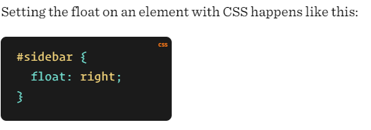
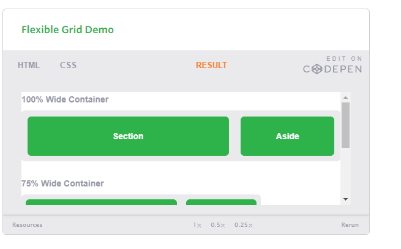
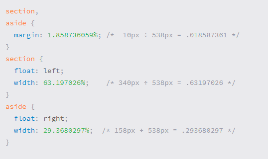
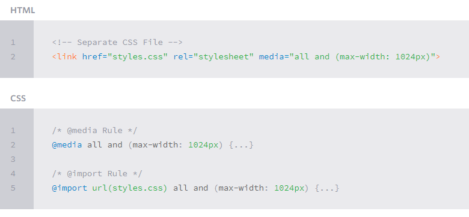
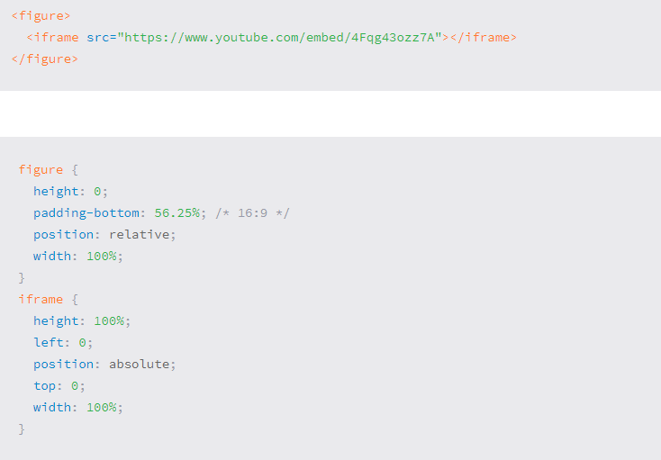

# Floats :
## What is A Float?
Float is a CSS property. floated remain a part of the flow of the web page. while Absolutely positioned page elements are removed from the flow of the webpage.

## how to use float:

## there are four valid values for float:
* left
* right
* none
* inhert

## What float are used for :

1. can create an entire page lay out.
2. Floats are also helpful for layout in smaller instances.

## clearing the float:
Float’s sister property is *clear*. An element that has the clear property set on it will not move up adjacent to the float like the float desires, but will move itself down past the float. 

## Clear has four valid values:

* left
* right
* none
* Both

## The Great Collapse:

Collapsing almost always needs to be dealt with to prevent strange layout and cross-browser problems. We fix it by clearing the float after the floated elements in the container but before the close of the container.

## Techniques for Clearing Floats:

* The Empty Div Method
* The Overflow Method
* The Easy Clearing Method : using (:after).

## Problems with Float:

* Pushdown
* Double Margin Bug
* The 3px Jog
* In IE 7, the Bottom Margin Bug

# Responsive Web Design :

## Responsive overview:

*Responsive web design is the practice of building a website suitable to work on every device and every screen size*.
 
**developed, by Ethan Marcotte.** and write a book called Responsive web design.  

## Responsive vs. Adaptive vs. Mobile:

Responsive generally means to react quickly and positively to any change, while adaptive means to be easily modified for a new purpose or situation.  

Mobile: generally means to build a separate website commonly on a new domain solely for mobile users.  

Currently the most popular technique lies within responsive web design. favoring design that dynamically adapts to different browser and device viewports, changing layout and content along the way.  

## Flexible Layouts:

Responsive web design is broken down into three main components:

1. including flexible layouts : the practice of building the layout of a website with a flexible grid.
2. media queries: 
3. flexible media: 

## including flexible layouts 

 the practice of building the layout of a website with a flexible grid.

Ex. Flexible Layouts:

## Media Queries:

provide the ability to specify different styles for individual browser and device circumstances, the width of the viewport or device orientation.

## Initializing Media Queries:

There are two ways to initialize Media Querry:
1. @ media : rule inside of an existing style sheet.
2. @ import : importing a new style sheet.  

Ex.:

### Common media types include: 
1. all.
2. screen.
3. print.
4. tv.
5. braille.

## Logical Operators in Media Queries:

1. and
2. not.
3. only.

## Omitting a Media Type:
When using the not and only logical operators the media type may be left off. In this case the media type is defaulted to all.

## Height & Width Media Features:
 using the height and width media features. Each of these media features may then also be prefixed with the min or max qualifiers, building a feature such as min-width or max-width.

 ## Orientation Media Feature
 The orientation media feature determines if a device is in the landscape or portrait orientation.

 ## Aspect Ratio Media Features

 The aspect-ratio and device-aspect-ratio features specifies the width/height pixel ratio of the targeted rendering area or output device.

 ## Resolution Media Feature

 The resolution media feature specifies the resolution of the output device in pixel density, also known as dots per inch or DPI. 

 ## Mobile First:

 includes using styles targeted at smaller viewports as the default styles for a website, then use media queries to add styles as the viewport grows.

 ## Viewport:

 Using the viewport meta tag with either the height or width values will define the height or width. nfor best results applying the device-height and device-width values.

## Flexable Media:

One quick way to make media scalable is by using the max-width property with a value of 100%. 

Ex.:

