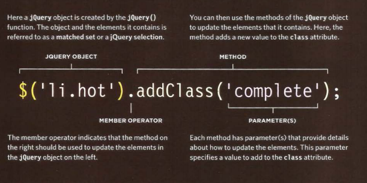
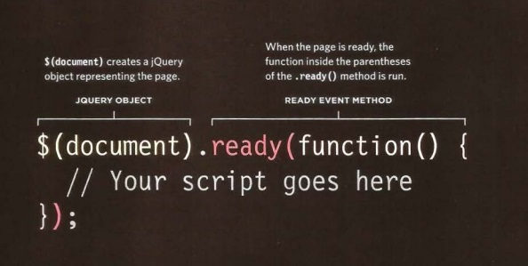
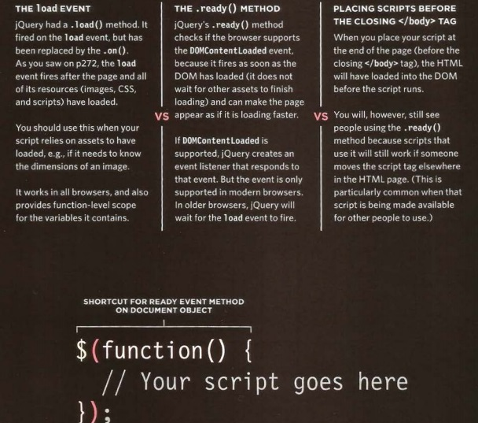

# 6 Reasons for Pair Programming:

We can Sumarize the benefits of using Pair Programming in the following 6 resons:

1. Grerater Efficiency.
Research indicates that pair programing takes slightly longer, but produces higher-quality code that doesn’t require later effort in troubleshooting and debugging.

2. Engaged collaboration.

the programmers will be more focusing and engaging. also they can help each other instead of looking for help from someone else.

3. Learning from fellow students

it will make the programmers share unique thoughts that one of them would never thinlk of.

4. Social skills

the programmers will improve their social skills.

5. Job interview readiness

For most roles, the ability to work with and learn from others and stellar communication skills are as important to a company than specific technical skills. Pair programming strengthens all of those skills.

6. Work environment readiness

pair programming is the way to work in a company. by learing pair programming will make us ready for work without the need of any training.

# Chapter 7 : jQuery

## What is jQuery : 
it is a JS file that included in web pages that let us find element using CSS selectors then do something with it using jQery methods.  

the jQuery benefits can be summrized in 3 points:

* Select Elements.
* Perform Tasks.
* Handle Events.

## how we find elements using CSS selectors?

it is wriiten like this to save time $() instead of jQuery().  

## Do something with elements using jQuery:

## WHY USE JQUERY? 

It is just a JavaScript file but estimates show it has been used on over a 
quarter of the sites on the web, because it makes coding simpler. like the following:

* Simple Selectors

* Common taks in less code.

## Matched Set / jQuery Selectors:

1. If the selector returns one element then jQery contains one element.
2. if the selector returns multiple elements then jQery contains multiple elements.

## jQuey method that get and set Data:

1. set information: $('li').html(); this will set element.

2. get information: $('li').html('updated'); this is tpo update the content.

## jQuery objects store references to elements:

when we create a selection with jQuery, it stores references not create copies.  

## Catching jQuery selections in variables:

should follow the following steps:

1. Find a matching nodes on the DOM tree.
2. Create the jQuery objects.
3. Store references to the nodes in the jQuery object.

## Checking a page ready to work with:

*jQuery's .ready()* method checks if the page is ready as the following ex.:

## GETTING ELEMENT CONTENT 
The • htm 1 () and • text () methods both retrieve and update the content of elements.

## UPDATING ELEMENTS:

Here are four methods that update the content of all elements in a jQuery selection:

1. . html():
This method gives every element 
in the matched set the same new 
content.

2. .replaceWith():
This method replaces every 
element in a matched set with 
new content.

3. . text():
This method gives every element 
in the matched set the same new 
text content.

4. . remove():
This method removes all of the 
elements in the matched set. 

## INSERTING ELEMENTS

Inserting new elements involves two steps: 
1. Create the new elements in a jQuery object. 
2. Use a method to insert the content into the page.

##  We can use the following methods to add the content to the DOM tree: 
* .before() 
This method inserts content 
before the selected element(s) . 
* .prepend() 
This method inserts content 
inside the selected element(s), 
after the opening tag. 
* .after() 
This method inserts content 
after the selected element(s). 
* .append() 
This method inserts content 
inside the selected element(s), 
before the closing tag. 

## GETTING AND SETTING ATTRIBUTE VALUES:

We can create attributes or access and update their contents using the following four methods. 

* .attr() 

* .addCl ass() 

* .removeAttr() 

* .removeClass() 

