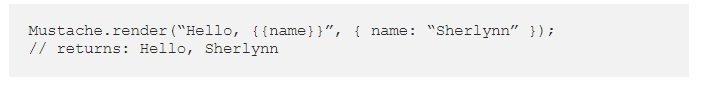
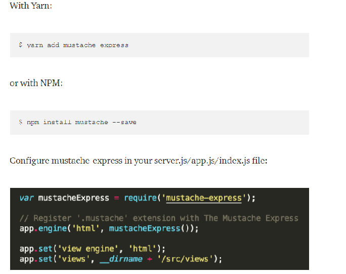

# Javascript Templating Language and Engine— Mustache.js with Node and Express

## Javascript Templating

it can be defind as fast and efficient technique to render client-side view templates with Javascript by using a JSON data source. it will either insert variables or run programming logic.  

then it will replace the variables with actual values and send it to the client.

## Mustache:

Mustache is a logic-less template syntax. It works by expanding tags in a template using values provided in a hash or object. 

*logic-less* because there are no if statements, else clauses, or for loops. Instead, there are only tags. 

## Mustache-Express:

# Flex Box:

The Flexbox Layout aims at providing a more efficient way to lay out, align and distribute space among items in a container.

## Flex Box properities:

1. Properties for the Parent (flex container):

* Display 
* Direction
* flex-wrap
* flex-flow
* justify-content
* align items
* align content

2. Properties for the Children (flex items):

* Order
* flex-grow
* flex-shrink
* flex-Basis
* flex
* align-self

