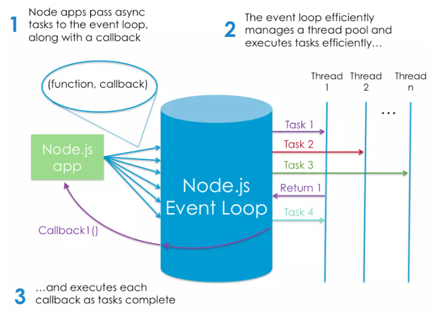

# What is Node.js:

Node.js is a JavaScript runtime built on Chrome’s V8 JavaScript engine.  

Node.js is an event-based, non-blocking, asynchronous I/O runtime that uses Google’s V8 JavaScript engine and libuv library. 

The V8 engine is the open-source JavaScript engine that runs in Google Chrome and other Chromium-based web browsers, including Brave, Opera, and Vivaldi. It was designed with performance in mind and is responsible for compiling JavaScript directly to native machine code that your computer can execute. 

This means that Node.js is a program we can use to execute JavaScript on our computers. In other words, it’s a JavaScript runtime. 

###  Node.js Has Excellent Support for Modern JavaScript

Node has excellent support for ECMAScript 2015 (ES6) and beyond. 

### What Is Node.js Used For?

installing (via npm) and running (via Node) various build tools — designed to automate the process of developing a modern JavaScript application. They can be used for anything from bundling your JavaScript files and dependencies into static assets, to running tests, or automatic code linting and style checking.

### The Node.js Execution Model

Node.js, however, is single-threaded. It’s also event-driven, which means that everything that happens in Node is in reaction to an event. 

The traditional approach to scaling a Node app is to clone it and have the cloned instances share the workload. Node.js even has a built-in module to help you implement a cloning strategy on a single server. 

Are There Any Downsides? 

The fact that Node runs in a single thread does impose some limitations.

### What Kind of Apps Is Node.js Suited To?

1. Node is particularly suited to building applications that require some form of real-time interaction or collaboration.

2. sites involving data streaming.s Node makes it possible to process files while they’re still being uploaded.

### What Are the Advantages of Node.js?

1. your brain no longer needs to switch modes. You can do everything in the same language.
2. it speaks JSON. JSON is probably the most important data exchange format on the Web.
3. JavaScript is ubiquitous: most of us are familiar with JavaScript, or have used it at some point. This means that transitioning to Node development is potentially easier than to other server-side languages.

